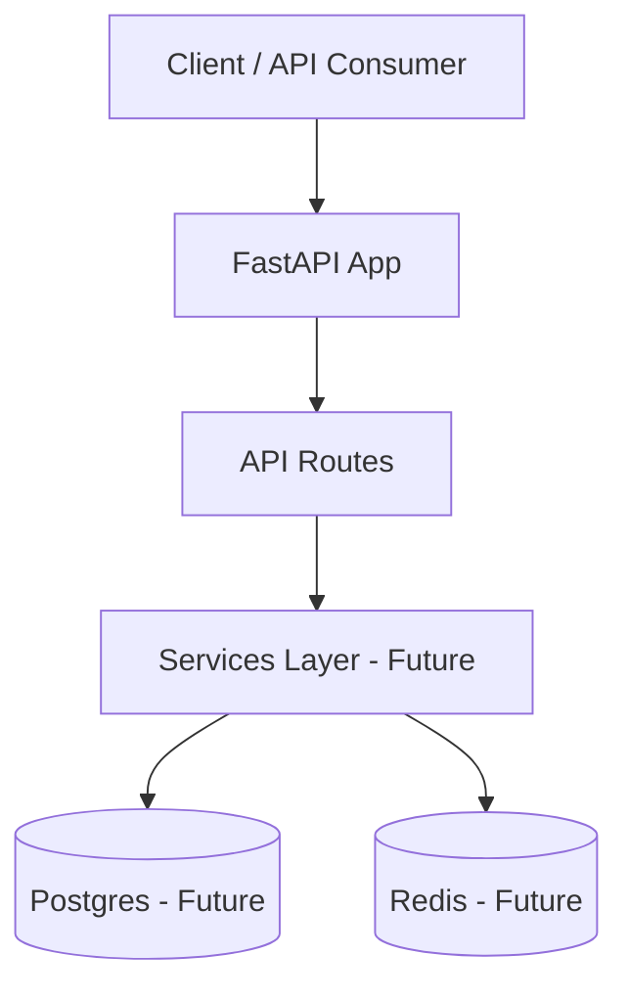

# AI Career Navigator

AI Career Navigator is a production-oriented Applied AI Engineering platform that combines structured analytics and Retrieval-Augmented Generation (RAG) to help users understand AI hiring trends, skill demand, and job requirements.

## Tech Stack

- Python 3.12
- FastAPI
- Pydantic
- UV
- Pytest
- Ruff
- MpPy
- Docker
- Github Actions

## Run Locally

```bash
uv sync
uv run uvicorn ai_career_navigator.main:app --reload
```

API:

```text
http://localhost:8000
```

Interactive Docs:

```text
http://localhost:8000/docs
```

## Run with Docker

```bash
docker compose up --build
```

API:

```text
http://localhost:8000
```

Interactive Docs:

```text
http://localhost:8000/docs
```

## Architecture



## Quality Checks

Run tests:

```bash
uv run pytest
```

Run linting:

```bash
uv run ruff check .
```

Run type checking:

```bash
uv run mypy src tests
```

Or use the Makefile:

```bash
make test
make lint
```

## Current Status

Project is in active development.

Current features:

- FastAPI application
- Configuration management with Pydantic Settings
- Structured logging
- Automated testing with pytest
- Linting and formatting with Ruff
- Static type checking with MyPy
- Pre-commit hooks
- Dockerized application
- Docker Compose development environment
- GitHub Actions CI pipeline